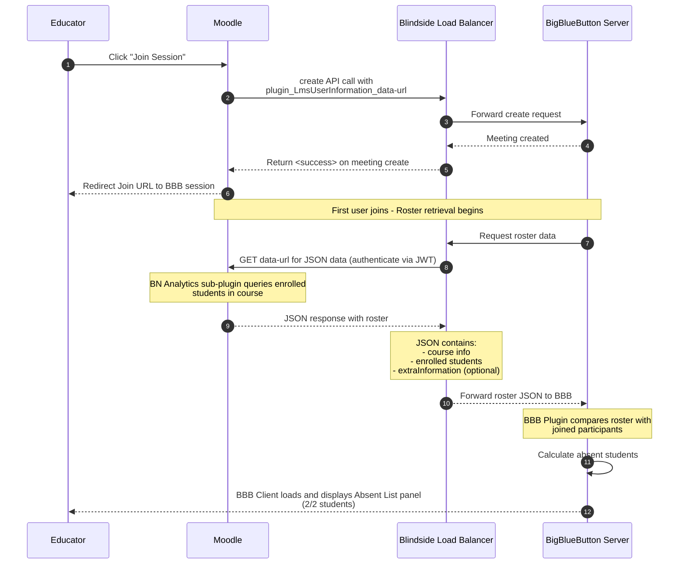
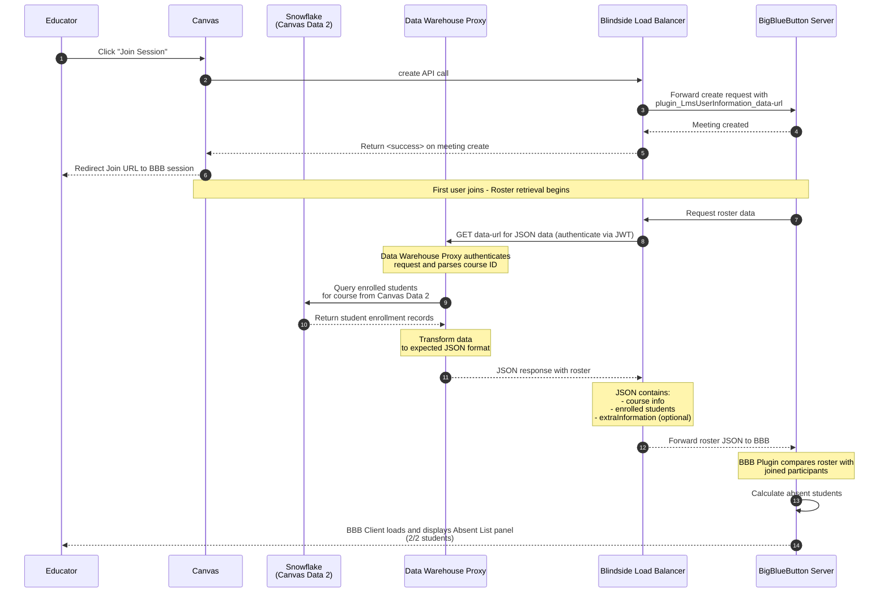

## Sequence Diagram for Moodle

```mermaid
sequenceDiagram
    autonumber
    participant Educator
    participant Moodle
    participant LB as Blindside Load Balancer
    participant BBB as BigBlueButton Server

    Educator->>Moodle: Click "Join Session"
    Moodle->>LB: create API call with<br/>plugin_LmsUserInformation_data-url
    LB->>BBB: Forward create request
    BBB-->>LB: Meeting created
    LB-->>Moodle: Return <success> on meeting create
    Moodle-->>Educator: Redirect Join URL to BBB session

    Note over BBB,Moodle: First user joins - Roster retrieval begins

    BBB->>LB: Request roster data
    LB->>Moodle: GET data-url for JSON data (authenticate via JWT)

    Note over Moodle: BN Analytics sub-plugin queries enrolled<br/>students in course

    Moodle-->>LB: JSON response with roster

    Note over LB: JSON contains:<br/>- course info<br/>- enrolled students<br/>- extraInformation (optional)

    LB-->>BBB: Forward roster JSON to BBB

    Note over BBB: BBB Plugin compares roster with<br/>joined participants

    BBB->>BBB: Calculate absent students
    BBB-->>Educator: BBB Client loads and displays Absent List panel<br/>(2/2 students)
```

## Sequence Diagram for Canvas

```mermaid
sequenceDiagram
    autonumber
    participant Educator
    participant Canvas
    participant SF as Snowflake<br/>(Canvas Data 2)
    participant DW as Data Warehouse Proxy
    participant LB as Blindside Load Balancer
    participant BBB as BigBlueButton Server

    Educator->>Canvas: Click "Join Session"
    Canvas->>LB: create API call
    LB->>BBB: Forward create request with<br/>plugin_LmsUserInformation_data-url
    BBB-->>LB: Meeting created
    LB-->>Canvas: Return <success> on meeting create
    Canvas-->>Educator: Redirect Join URL to BBB session

    Note over BBB,Canvas: First user joins - Roster retrieval begins

    BBB->>LB: Request roster data
    LB->>DW: GET data-url for JSON data (authenticate via JWT)

    Note over DW: Data Warehouse Proxy authenticates<br/>request and parses course ID

    DW->>SF: Query enrolled students<br/>for course from Canvas Data 2
    SF-->>DW: Return student enrollment records

    Note over DW: Transform data<br/>to expected JSON format

    DW-->>LB: JSON response with roster

    Note over LB: JSON contains:<br/>- course info<br/>- enrolled students<br/>- extraInformation (optional)

    LB-->>BBB: Forward roster JSON to BBB

    Note over BBB: BBB Plugin compares roster with<br/>joined participants

    BBB->>BBB: Calculate absent students
    BBB-->>Educator: BBB Client loads and displays Absent List panel<br/>(2/2 students)
```
